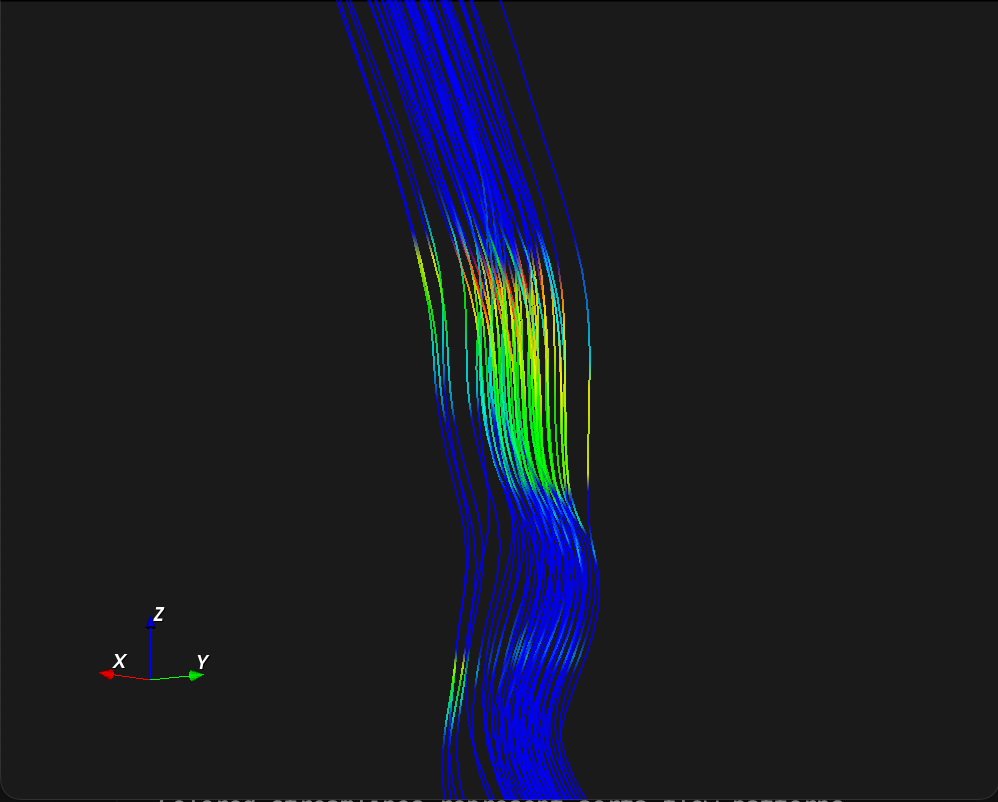

# 4D Flow Aorta Streamline Visualization



A C++ application for visualizing 4D Flow blood flow patterns in the aorta using VTK streamlines.

## Technical Details

### DICOM Rescaling and Velocity Conversion

The application processes DICOM phase images to extract velocity information using the following mathematical transformations:

1. **DICOM Rescaling**: Raw pixel values are converted to physical units using DICOM metadata:
   ```
   Physical Value = (Raw Pixel Value × Slope) + Intercept
   ```

2. **Phase to Velocity Conversion**: Phase values are converted to velocity using the VENC (Velocity ENCoding) parameter:
   ```
   Velocity = (Phase Value / π) × VENC
   ```

This conversion transforms phase-encoded MRI data into actual blood flow velocities for 3D streamline visualization.

## Features

- **4D Flow Velocity Field Visualization**: Loads and displays velocity data from DICOM phase images
- **Interactive Streamlines**: GPU-accelerated streamline generation showing blood flow patterns
- **Color-coded Flow**: Streamlines colored by velocity magnitude (Blue=low, Red=high)
- **3D Navigation**: Interactive camera controls for exploring the 3D flow field
- **ROI-based Seeding**: Automatic seed point generation within aorta region of interest

## Dependencies

- **VTK 9.4.2**: Visualization Toolkit for 3D graphics
- **DCMTK**: DICOM file reading and processing
- **C++17**: Modern C++ standard library

## Data Structure

Expects 4D DICOM data organized as:
- `/1` - X-velocity phase images
- `/2` - Y-velocity phase images  
- `/3` - Z-velocity phase images
- `/mag` - Magnitude images

## Build & Run

```bash
mkdir build && cd build
cmake ..
make
./main
```

## Controls

- **Mouse**: Rotate view
- **Scroll**: Zoom in/out
- **Right-click + drag**: Pan view
- **3D Axes**: Orientation reference in bottom-left corner

## Output

Generates interactive 3D visualization showing:
- Colored streamlines representing blood flow paths
- Velocity magnitude color mapping
- 3D coordinate system for orientation 
